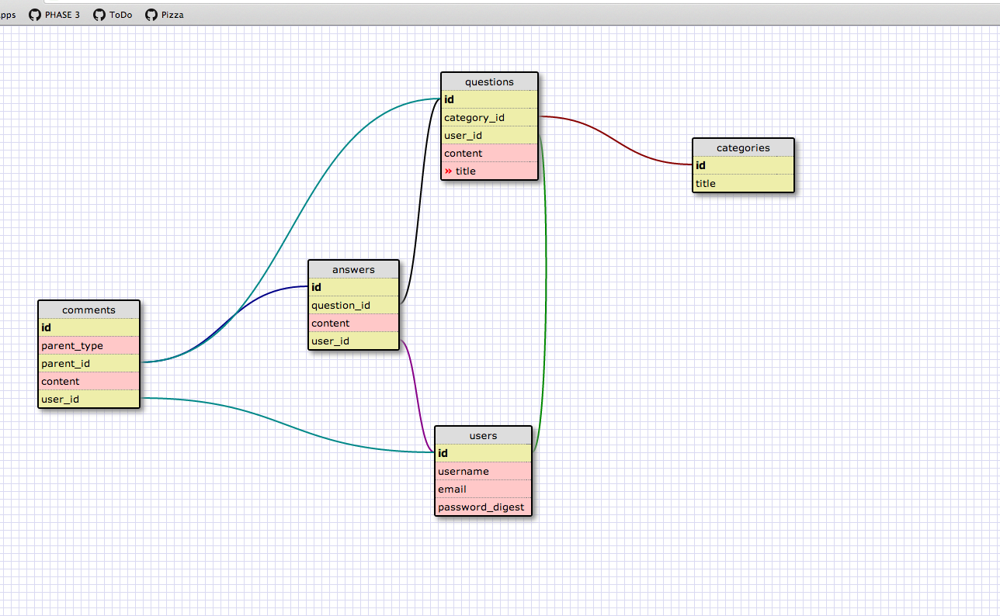

DBCoverflow
===========
## Overview

DBCoverflow is an app for Dev Bootcamp staff, students, and alumni to provide online support to each other in the form of posted questions and answers, as well as comments on each of those questions and/or answers. While the information is available to the public, the ability to post questions, answers, or comments is limited to registered users.

DBCoverflow is similar to [stackoverflow](http://stackoverflow.com/) in that it provides a persistent repository for technical questions and answers, but slightly different in that its categories for questions will also include areas such as Engineering Empathy, Logistics, etc. Questions and support regarding specific topics and challenges are also encouraged.

## User Perspective

Check out [DBCoverflow](http://dbc-overflow-ckmr.herokuapp.com/)! Check out some questions, answers, and comments, and create an account for yourself. Feel free to post some stuff!

## Dependencies

DBCoverflow is a stand-alone app deployed through [Heroku](https://id.heroku.com/login). 

## Contact Us and/or Contribute

DBCoverflow is created and managed by Catherine, Kim, Monica, and Rick. To reach us or to contribute, submit an issue or pull request to this repo. Please be sure to use the Pickles-Approved git process below, as well as our schema and other documentation.

## Pickles-Approved Git Process

### To start working on the app:
1. git clone "the master"
2. git checkout -b "your_branch_name"
3. git pull origin master

### To submit a pull request:
1. git checkout {your_branch_name}
2. git add/commit your changes
3. git pull origin master (will try to merge; fix conflicts if necessary)
4. git add/commit any changes
5. git push origin {your_branch_name}
6. On GitHub, submit a pull request

## DBCoverflow Schema:

## Testing

All of our tests are written in RSpec, not Rails' standard Test suite. Note that we are using the ['shoulda'](https://github.com/thoughtbot/shoulda) gem in many of our model and controller tests, as well as ['capybara'](https://github.com/jnicklas/capybara) for our feature/integration tests. Much of the app's functionality is determined by whether a user is logged in or not.

## Agile Development

This app is still very much in development. Our team uses agile methodology, and manages our scrum board with [Trello](https://trello.com/b/kI5uhSO1/dbc-overflow). Communication 

